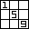

<!-- PROJECT LOGO -->
 

  

<h3 align="center">sudoku-js</h3>

  

    Sudoku written completely in JavaScript, HTML, and CSS.
     
    <a href="https://github.com/christian4747/sudoku-js"><strong>Explore the docs »</strong></a>
     
     
    <a href="https://github.com/christian4747/sudoku-js">View Demo</a>
    ·
    <a href="https://github.com/christian4747/sudoku-js/issues">Report Bug</a>
    ·
    <a href="https://github.com/christian4747/sudoku-js/issues">Request Feature</a>
  

[![MIT License][license-shield]][license-url]

<!-- TABLE OF CONTENTS -->

  
Table of Contents

  <ol>
    <li>
      <a href="#about-the-project">About The Project</a>
      <ul>
        <li><a href="#built-with">Built With</a></li>
      </ul>
    </li>
    <li><a href="#license">License</a></li>
    <li><a href="#acknowledgments">Acknowledgments</a></li>
  </ol>

<!-- ABOUT THE PROJECT -->
## About The Project

[![Product Name Screen Shot][product-screenshot]](https://example.com)

An implementation of the game Sudoku written in HTML, CSS, and JavaScript. Pretty much finished, but if I feel like it there may be updates.

Features:
* Generate random *non-unique* Sudoku games!
* Turn note mode on or off to place number notes on your board!
* Auto saves the progress of your Sudoku board every 15 seconds in local storage!
* Auto solve your given Sudoku board! (make sure to delete your current board modifications)
* Undo and redo changes you make to the Sudoku board!
* Responsive styling to fit as many screens as possible!
* Confetti when you win!
* ...and more!

(<a href="#readme-top">back to top</a>)

### Built With

* [![HTML5][HTML5]][HTML5-url]
* [![CSS3][CSS3]][CSS3-url]
* [![JavaScript][JavaScript]][JavaScript-url]

(<a href="#readme-top">back to top</a>)

<!-- LICENSE -->
## License

Distributed under the MIT License. See `LICENSE` for more information.

(<a href="#readme-top">back to top</a>)

<!-- ACKNOWLEDGMENTS -->
## Acknowledgments

* [js-confetti](https://www.npmjs.com/package/js-confetti)
* [Best README Template](https://github.com/othneildrew/Best-README-Template)

(<a href="#readme-top">back to top</a>)

<!-- MARKDOWN LINKS & IMAGES -->
<!-- https://www.markdownguide.org/basic-syntax/#reference-style-links -->
[license-shield]: https://img.shields.io/github/license/christian4747/sudoku-js.svg?style=for-the-badge
[license-url]: https://github.com/christian4747/sudoku-js/blob/master/LICENSE
[product-screenshot]: images/screenshot.png
[HTML5]: https://img.shields.io/badge/-HTML5-000000?style=for-the-badge&logo=html5&logoColor=white&color=%23E34F26
[HTML5-url]: https://en.wikipedia.org/wiki/HTML5
[CSS3]: https://img.shields.io/badge/-CSS3-000000?style=for-the-badge&logo=css3&color=%231572B6
[CSS3-url]: https://en.wikipedia.org/wiki/CSS
[JavaScript]: https://img.shields.io/badge/-JavaScript-000000?style=for-the-badge&logo=javascript&color=000000
[JavaScript-url]: https://en.wikipedia.org/wiki/JavaScript